# 목차

1. **[서비스 소개](#서비스-소개)**
2. **[기획 배경](#기획-배경)**
3. **[기능 소개](#기능-소개)**
4. **[시연 영상](#시연-영상)**
5. **[기술 스택](#기술-스택)**
6. **[프로젝트 일정 및 산출물](#프로젝트-일정-및-산출물)**
7. **[프로젝트 폴더 구조](#프로젝트-폴더-구조)**
8. **[개발 멤버](#개발-멤버)**

---

# 🦍서비스 소개

## 서비스 설명

### 개요

- 한줄 소개 : 위치기반 탐험 소셜미디어 서비스
- 서비스 명 : Adventure Everyday

### 타겟 🎯

- 반복되는 일상 속에서 똑같은 거리에 변화를 주고싶은 사람들

# 🦍기획 배경

## 배경

- 기존의 SNS의 문제점 중 하나는, 나와 너무 동떨어진 이야기들이 많아 점점 피로감을 느끼는 사람이 늘고 있다
- 

## 목적 🥅

- 컨텐츠와 사용자 사이에 “공간”이라는 연결고리를 마련해서, 사용자들이 같은 공간에서의 경험을 공감하고 공유할 수 있게 하였습니다.

## 의의

- 

# 🦍기능 소개

# 🦍시연 영상

## 로그인/회원가입
{width=50px height=100px}
## 메인 화면
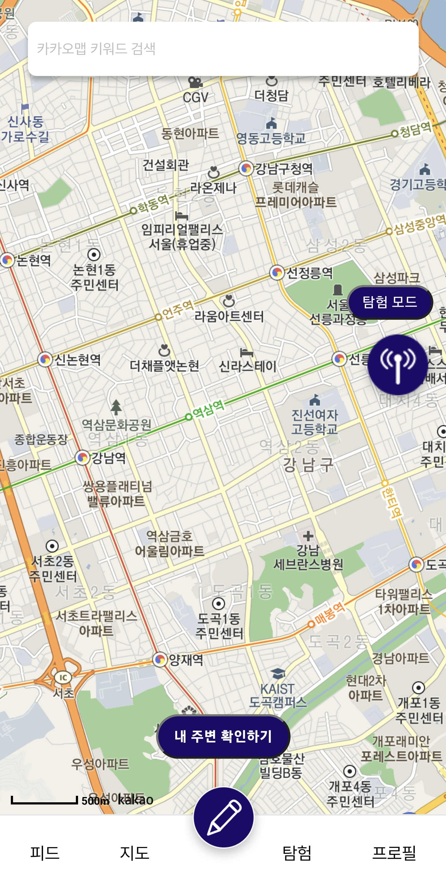{width=50px height=100px}
## 메인 화면(탐험모드)
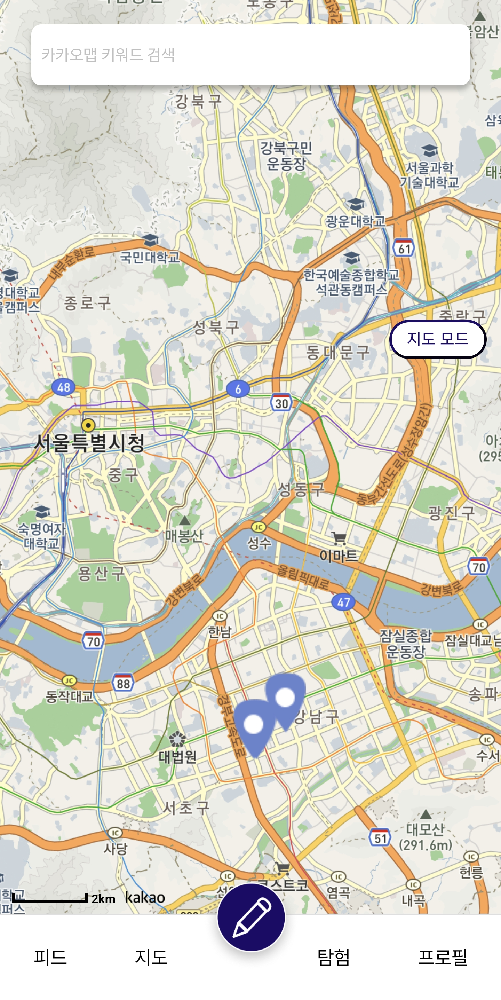{width=50px height=100px}
## 내 주변 글
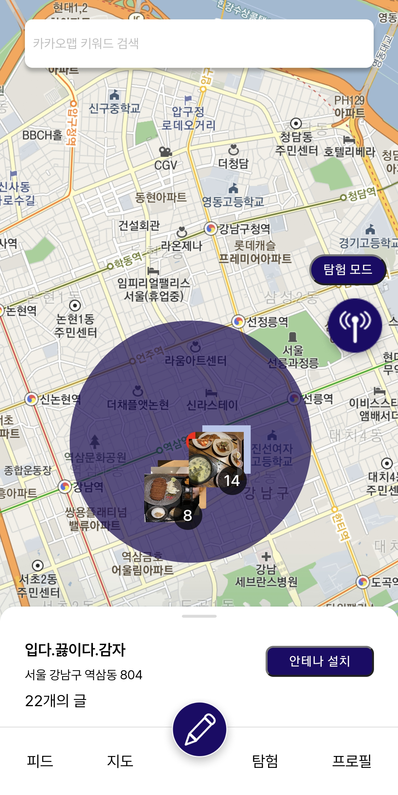{width=50px height=100px}
## 특정위치 주변 글
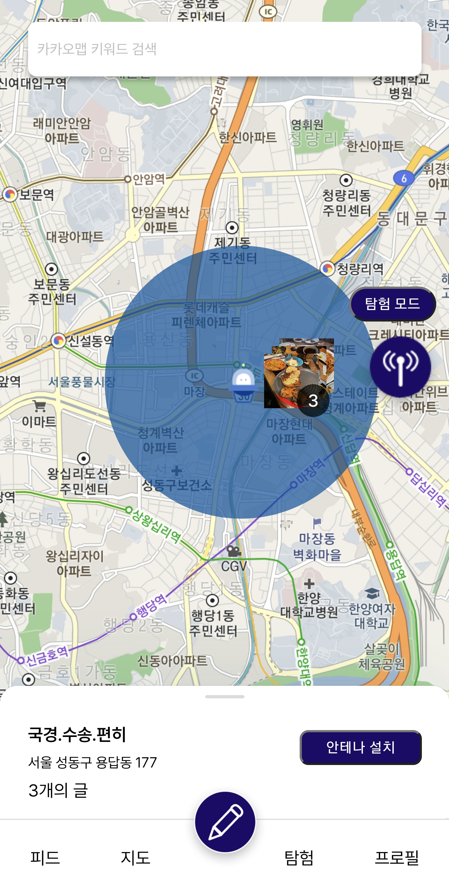{width=50px height=100px}
## 특정위치 주변 글 상세보기
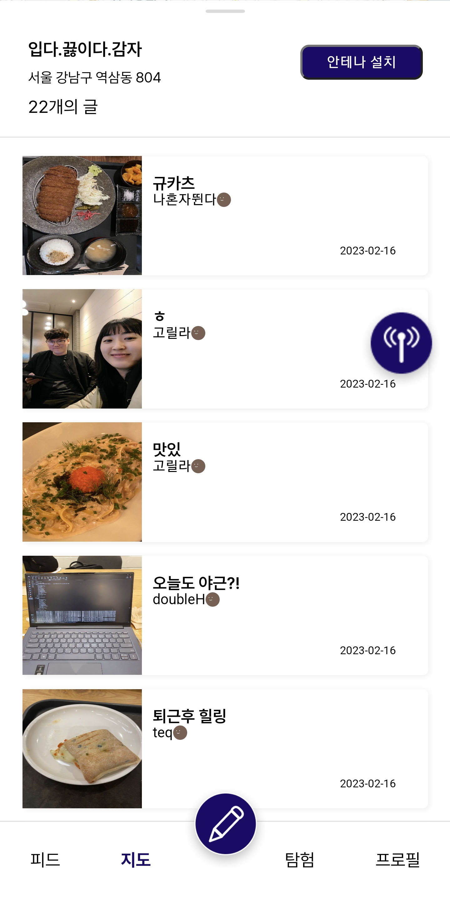{width=50px height=100px}
## 팔로우 피드
{width=50px height=100px}
## 탐험 피드
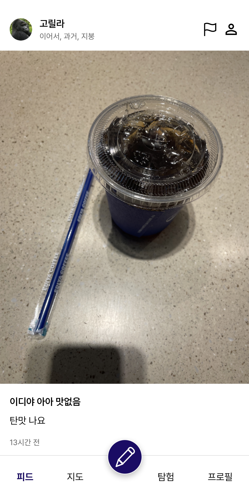{width=50px height=100px}
## 안테나 피드
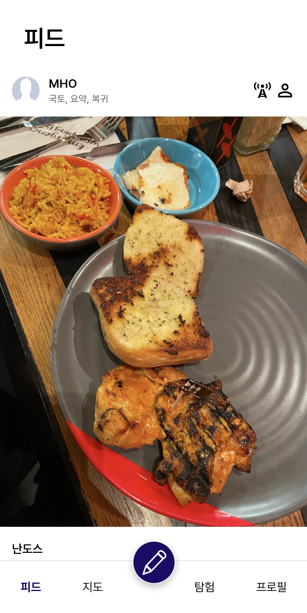{width=50px height=100px}
## 포스팅
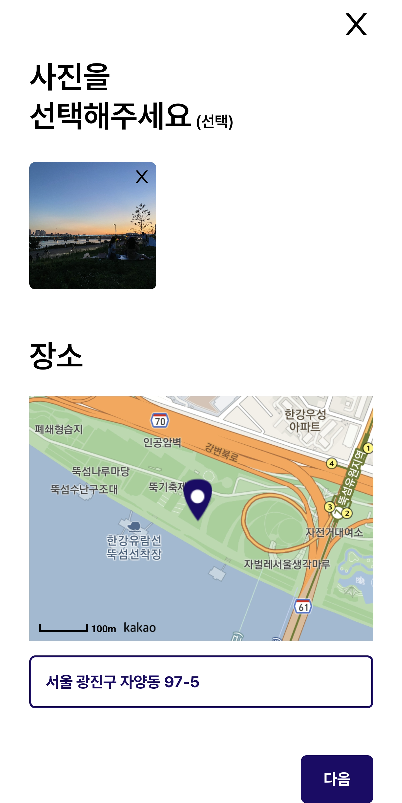{width=50px height=100px}
## 포스팅 결과화면
{width=50px height=100px}
## 체크포인트 포스팅
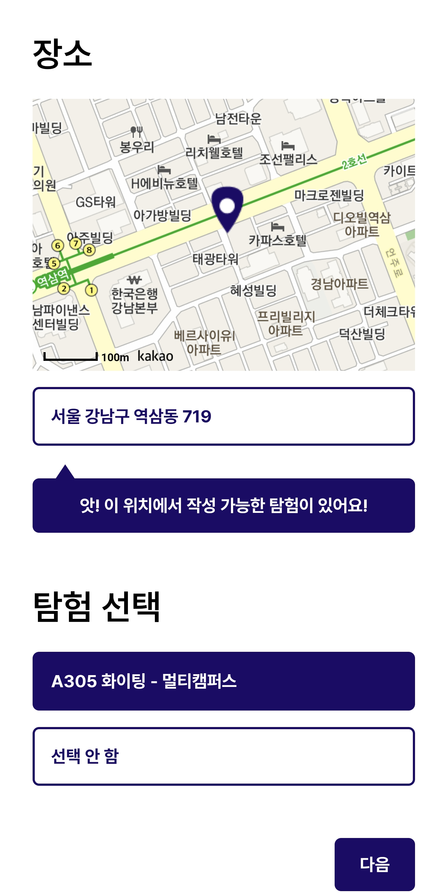{width=50px height=100px}
## 체크포인트 포스팅 결과화면
{width=50px height=100px}
## 탐험완료 결과화면
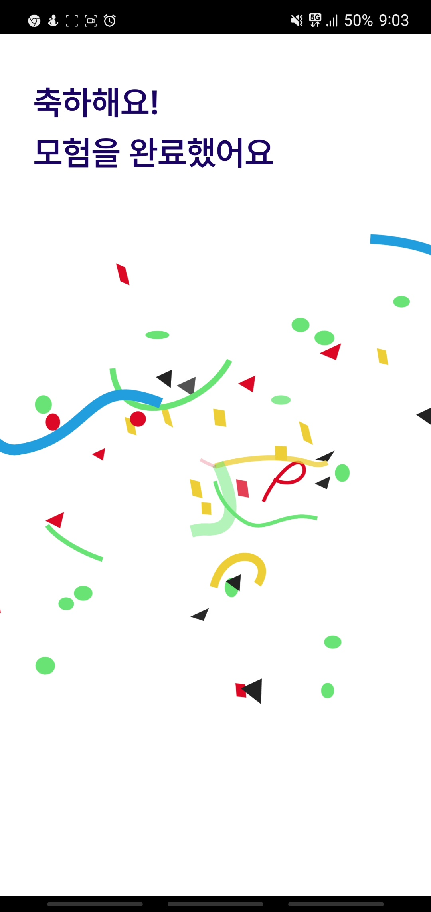{width=50px height=100px}
## 마이페이지
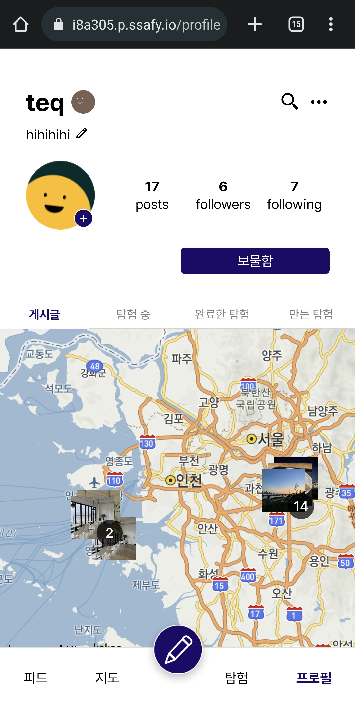{width=50px height=100px}
## 팔로우
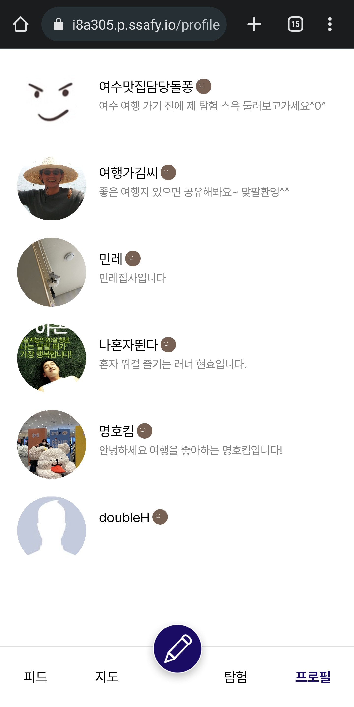{width=50px height=100px}
## 마이페이지 탐험중
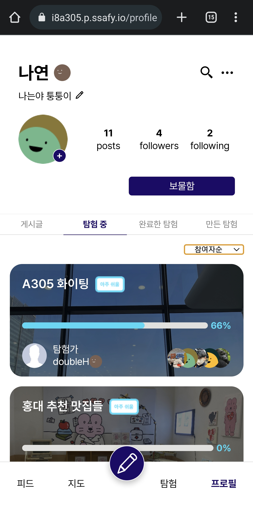{width=50px height=100px}
## 마이페이지 탐험중 소팅
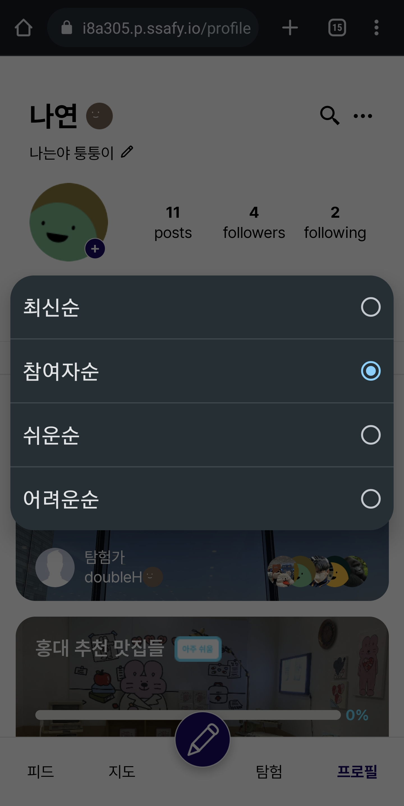{width=50px height=100px}
## 마이페이지 탐험완료
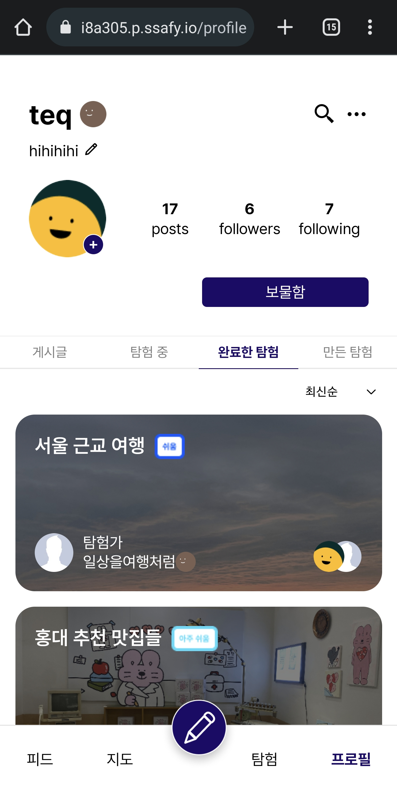{width=50px height=100px}
## 마이페이지 마이탐험
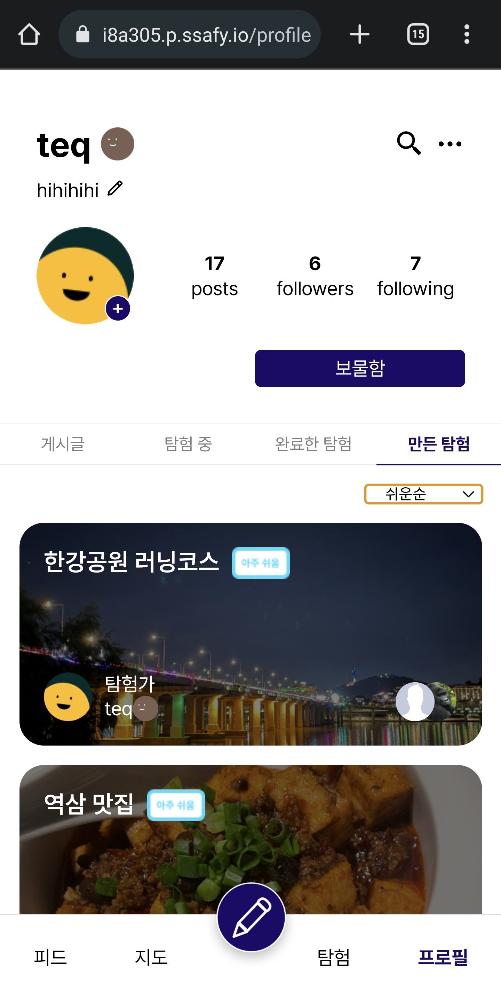{width=50px height=100px}

# 🦍기술 스택

### [FE]

- React
- Redux Toolkit
- Node.js
- KakaoMap API
- Figma
- Visual Studio Code

### [BE]

- Spring Boot
- Gradle(Kotlin)
- MySQL
- Spring Data JPA
- Spring Security
- JWT
- Docker
- Docker Compose
- SSL
- NGINX
- AWS(EC2, S3)
- Intellij

### [ETC]

- Jira
- GitLab
- W3W
- Notion
- Postman
- Mattermost
- Webex

# 🦍프로젝트 일정 및 산출물

## 프로젝트 일정

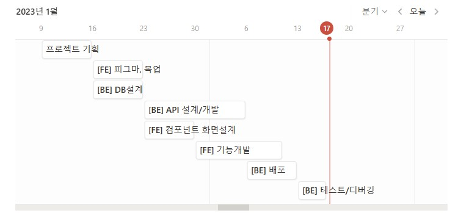

## 프로젝트 진행

### 1. Git flow

---

### 브랜치 전략

- master
    - 배포 가능한 상태의 결과물
- dev
    - 구현한 기능을 병합하기 위한 브랜치
    - 통합 폴더의 기능
- feature
    - 개별 기능 구현 브랜치
    - 기능 개발 완료 시 삭제
    - 네이밍 규칙
        - ex. feature/`function`/front
        - ex. feature/`function`/back

### 커밋 컨벤션

- 구조
    - 태그와 제목으로 구성
        - `태그: 제목`

- 태그
    - 영어로 쓰되 첫 문자는 대문자로 작성
    - 종류
        - `Feat` : 새로운 기능 추가
        - `Fix` : 버그 수정
        - `Docs` : 문서 수정
        - `Design` : css 등 사용자 UI 디자인 변경
        - `Style` : 코드 포맷팅, 세미콜론 수정 등 코드가 아닌 형식 수정
        - `Refactor` : 코드 리팩토링
        - `Test` : 테스트 코드 추가 및 리팩토링 테스트 등
        - `Chore` : 빌드 업무 수정, 패키지 매니저 수정 등
        - `Init` : 프로젝트 신규 생성, 라이브러리 설치 등
        - `Rename` : 파일명을 수정하거나 옮기는 작업
        - `Remove` : 파일을 삭제하는 작업

- 제목
    - 최대 50글자
    - 한글로 작성하며, 영어로 시작하는 경우 대문자로 시작
    - 마침표 및 특수기호는 사용하지 않음

### 2. Jira

---

### Epic

- 큰 파트 생성
- 기획 / 화면설계 / DB / 개발 / 배포 / 테스트 / 학습
    - [ ]  개발 세분화 내용 반영

### Story

- 회원에게 제공되는 서비스/기능 목록
- 네이밍 규칙
    - 명사로 마무리
    - ex. 회원가입, 로그인, 게시물 작성
- Story Point는 0

### Task

- 해당 스토리에 관련한 상세 구현 사항
- 네이밍 규칙
    - 파트는 대괄호에 작성
    - 명사로 마무리
    - ex. [BE] 유저 모델 작성
- Story Point는 4 이하로 작성
- SubTask 작성 대신 확인 가능한 Task로 세분화하여 작성

## 프로젝트 산출물

### 1. Figma


### 2. ERD

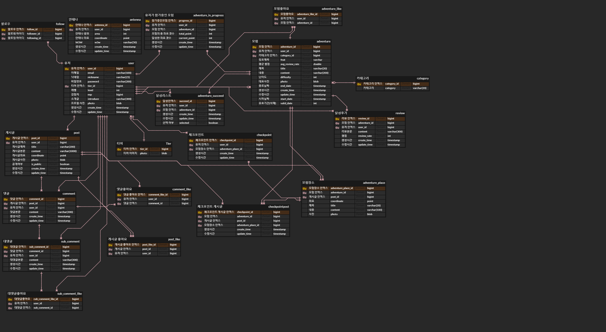

### 3. API 문서

[POSTMAN](https://documenter.getpostman.com/view/17785045/2s8ZDd115D)

[API](./docs/API.pdf)

# 🦍프로젝트 폴더 구조

```bash
+---backend
|   \---antenna
|       +---antenna-data
|       |   +---#innodb_redo
|       |   +---antennadb
|       |   +---mysql
|       |   +---performance_schema
|       |   \---sys
|       +---gradle
|       |   \---wrapper
|       \---src
|           +---main
|           |   \---java
|           |       \---com
|           |           \---ssafy
|           |               \---antenna
|           |                   +---config
|           |                   +---controller
|           |                   +---domain
|           |                   |   +---adventure
|           |                   |   |   \---dto
|           |                   |   |       +---click
|           |                   |   |       +---req
|           |                   |   |       +---res
|           |                   |   |       \---sub
|           |                   |   +---antenna
|           |                   |   |   \---dto
|           |                   |   +---category
|           |                   |   +---comment
|           |                   |   |   +---dto
|           |                   |   |   \---mapper
|           |                   |   +---email
|           |                   |   |   \---dto
|           |                   |   +---like
|           |                   |   |   \---dto
|           |                   |   +---location
|           |                   |   +---post
|           |                   |   |   +---dto
|           |                   |   |   \---mapper
|           |                   |   +---tier
|           |                   |   \---user
|           |                   |       +---dto
|           |                   |       \---mapper
|           |                   +---exception
|           |                   |   +---bad_request
|           |                   |   +---conflict
|           |                   |   +---forbidden
|           |                   |   +---internal_server_error
|           |                   |   +---not_found
|           |                   |   +---request_timeout
|           |                   +---service
|           |                   \---util
|           \---test
|               \---java
|                   \---com
|                       \---ssafy
|                           \---antenna
+---docs
\---frontend
    +---conf
    +---public
    |   \---images
    \---src
        +---components
        |   +---Adventure
        |   |   \---review
        |   +---adventureCreate
        |   +---Article
        |   |   \---Comment
        |   +---articleCreate
        |   +---BottomSheet
        |   +---mapPage
        |   |   \---antenna
        |   +---profile
        |   \---SignUp
        +---pages
        \---store
```

# 🦍개발 멤버
## [FE]
- 김나연 : 기획 및 디자인, Jira관리 총괄
- 김준형 : UX/UI, 회의진행 및 발표
- 조은비 : 디자인 총괄, UCC
## [BE]
- 권택윤 : API, Docker, JWT
- 김명호 : DB 설계, API, S3 관리
- 김현호 : API, JPA, DB 설계