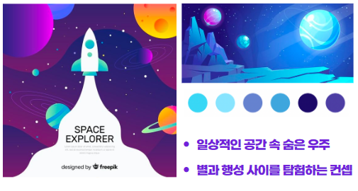

# 목차

1. **[서비스 소개](#서비스-소개)**
2. **[기획 배경](#기획-배경)**
3. **[디자인 컨셉](#디자인-컨셉)**
4. **[시연 영상](#시연-영상)**
5. **[기술 스택](#기술-스택)**
6. **[프로젝트 일정 및 산출물](#프로젝트-일정-및-산출물)**
7. **[프로젝트 폴더 구조](#프로젝트-폴더-구조)**
8. **[개발 멤버](#개발-멤버)**

---

# 🦍서비스 소개

## 서비스 설명

### 개요

- 한줄 소개 : 위치기반 탐험 소셜미디어 서비스
- 서비스 명 : Adventure Everyday

### 타겟 🎯

- 반복되는 일상 속에서 똑같은 거리에 변화를 주고싶은 사람들

# 🦍기획 배경

## 배경

- 기존의 SNS의 문제점 중 하나는, 나와 너무 동떨어진 이야기들이 많아 점점 피로감을 느끼는 사람이 늘고 있다
- 누군가의 이야기가 아닌 내 주변 공간, 내가 관심있는 공간에 숨겨진 이야기들이 궁금한 사람들이 많으나 그런 서비스가 없어 아쉬움을 느끼고 있다.
- 매일 매일 똑같은 삶에 지루함과 무료함을 느끼는 사람들이 많다.

## 목적 🥅

- 내가 알고 싶은 정보로만 피드 구성 가능
- 내 주변 공간에 다녀간 사람들의 숨겨진 이야기들 구경 가능
- 사용자들이 같은 공간에서의 경험을 공감하고 공유할 수 있게 하여 평범한 일상 속 **특별한 경험 제공**
- 탐험을 통해 반복되는 일상 속에서 내가 관심있는 도전을 할 수 있게 하고, 새로운 관심을 갖게 하여 매일이 새로운 경험으로 가득한 일상을 만들어 줄 수 있음

## 의의

- 반복되는 일상에 싫증이 나고 무의미하게 느껴지는 사람들이 우리 서비스를 통해 자신의 관심사를 탐험하고, 이 과정에서 즐거움을 느낄 수 있다.
- 보물을 모으는 과정을 통해 내가 달성한 탐험들을 확인할 수 있고, 새로운 탐험을 하려는 의지가 삶의 무료함을 해소하는데 도움이 될 것이다.
- 내가 원하는 지역의 정보만 받을 수 있어 내가 더 관심을 기울이는 주변 정보만을 피드로 받을 수 있으며, 팔로우 한 사람의 정보까지 받을 수 있게 하여 나의 관심사에 적합한 정보를 더 많이 받을 수 있다.
- 새로운 지역에 갔을 때도 실제로 동네 사람이 경험한 정보를 통해 신뢰성 있는 정보를 받아볼 수 있다.

# 🦍디자인 컨셉


# 🦍시연 영상

## 로그인

1. **이메일 로그인**


2. **카카오 로그인**


## 회원가입

1. **이메일로 회원가입**


2. **카카오로 회원가입**


3. **탈퇴하기**


## 지도

1. **글 확인하기**

    **1-1. 내 주변**

    
    
    **1-2. UFO**

    

2. **글 목록 확인**

    

3. **안테나 설치**

    

4. **안테나 뽑기**

    

5. **지도모드/탐험모드 기능**

    

6. **장소 검색**

    

## 피드

1. **피드 조회**
    
    

2. **댓글 페이지**
    
    

3. **게시글 상세 조회**

    **3-1. 작성자 프로필 및 작성 장소 조회**

    

    **3-2. 게시글 카테고리 조회**

    

    **3-3. 게시글 수정**

    

    **3-4. 게시글 삭제**

    

## 글작성

1. **사진 있이 글 작성**


2. **사진 없이 글 작성**


3. **비공개 글 작성**
    - **피드에서 비공개 확인**


## 탐험

1. **탐험 큐레이션 보여주기**
    
    **1-1. 스크롤, 더보기**

    
    
2. **탐험 상세 조회**
    
    **2-1. 탐험 지도 체크포인트 정보 조회**

    
    
    **2-2. 탐험 참여/포기**

    
    
    **2-3. 탐험 후기 조회/작성/수정/삭제**

    
        
    **2-4. 탐험 공유 (url복사)**

    
    
    **2-5. 참여자 목록 조회**

    
    
3. **탐험 글 작성**
    
    **3-1. 체크포인트 달성**

    
    
    **3-2. 탐험 달성**
    
   

4. **탐험 검색**

    

5. **탐험 생성**

    

## 프로필

1. **유저 검색**


2. **탐험 중, 탐험 완료, 만든 탐험 조회**


3. **보물함 조회**


4. **팔로잉, 팔로워 조회**


5. **프로필 사진 수정**


6. **자기소개 수정**


7. **프로필 화면에서 지도에 떠있는 내가 쓴 게시글 눌러보기**


8. **로그아웃**


<!-- ## 로그인/회원가입


## 메인 화면


## 메인 화면(탐험모드)


## 내 주변 글


## 특정위치 주변 글


## 특정위치 주변 글 상세보기


## 팔로우 피드


## 탐험 피드


## 안테나 피드


## 포스팅


## 포스팅 결과화면


## 체크포인트 포스팅


## 체크포인트 포스팅 결과화면


## 탐험완료 결과화면


## 마이페이지


## 팔로우


## 마이페이지 탐험중


## 마이페이지 탐험중 소팅


## 마이페이지 탐험완료


## 마이페이지 마이탐험
 -->


# 🦍기술 스택

### [FE]

- React
- Redux Toolkit
- Node.js
- KakaoMap API
- Figma
- Visual Studio Code

### [BE]

- Spring Boot
- Gradle(Kotlin)
- MySQL
- Spring Data JPA
- Spring Security
- JWT
- Docker
- Docker Compose
- SSL
- NGINX
- AWS(EC2, S3)
- Intellij

### [ETC]

- Jira
- GitLab
- W3W
- Notion
- Postman
- Mattermost
- Webex

# 🦍프로젝트 일정 및 산출물

## 프로젝트 일정


## 프로젝트 진행

### 1. Git flow

---

### 브랜치 전략

- master
    - 배포 가능한 상태의 결과물
- dev
    - 구현한 기능을 병합하기 위한 브랜치
    - 통합 폴더의 기능
- feature
    - 개별 기능 구현 브랜치
    - 기능 개발 완료 시 삭제
    - 네이밍 규칙
        - ex. feature/`function`/front
        - ex. feature/`function`/back

### 커밋 컨벤션

- 구조
    - 태그와 제목으로 구성
        - `태그: 제목`

- 태그
    - 영어로 쓰되 첫 문자는 대문자로 작성
    - 종류
        - `Feat` : 새로운 기능 추가
        - `Fix` : 버그 수정
        - `Docs` : 문서 수정
        - `Design` : css 등 사용자 UI 디자인 변경
        - `Style` : 코드 포맷팅, 세미콜론 수정 등 코드가 아닌 형식 수정
        - `Refactor` : 코드 리팩토링
        - `Test` : 테스트 코드 추가 및 리팩토링 테스트 등
        - `Chore` : 빌드 업무 수정, 패키지 매니저 수정 등
        - `Init` : 프로젝트 신규 생성, 라이브러리 설치 등
        - `Rename` : 파일명을 수정하거나 옮기는 작업
        - `Remove` : 파일을 삭제하는 작업

- 제목
    - 최대 50글자
    - 한글로 작성하며, 영어로 시작하는 경우 대문자로 시작
    - 마침표 및 특수기호는 사용하지 않음

### 2. Jira

---

### Epic

- 큰 파트 생성
- 기획 / 화면설계 / DB / 개발 / 배포 / 테스트 / 학습
    - [ ]  개발 세분화 내용 반영

### Story

- 회원에게 제공되는 서비스/기능 목록
- 네이밍 규칙
    - 명사로 마무리
    - ex. 회원가입, 로그인, 게시물 작성
- Story Point는 0

### Task

- 해당 스토리에 관련한 상세 구현 사항
- 네이밍 규칙
    - 파트는 대괄호에 작성
    - 명사로 마무리
    - ex. [BE] 유저 모델 작성
- Story Point는 4 이하로 작성
- SubTask 작성 대신 확인 가능한 Task로 세분화하여 작성

## 프로젝트 산출물

### 1. Figma


### 2. ERD


### 3. API 문서

[POSTMAN](https://documenter.getpostman.com/view/17785045/2s8ZDd115D)

[API](./docs/API.pdf)

# 🦍프로젝트 폴더 구조

```bash
+---backend
|   \---antenna
|       +---antenna-data
|       |   +---#innodb_redo
|       |   +---antennadb
|       |   +---mysql
|       |   +---performance_schema
|       |   \---sys
|       +---gradle
|       |   \---wrapper
|       \---src
|           +---main
|           |   \---java
|           |       \---com
|           |           \---ssafy
|           |               \---antenna
|           |                   +---config
|           |                   +---controller
|           |                   +---domain
|           |                   |   +---adventure
|           |                   |   |   \---dto
|           |                   |   |       +---click
|           |                   |   |       +---req
|           |                   |   |       +---res
|           |                   |   |       \---sub
|           |                   |   +---antenna
|           |                   |   |   \---dto
|           |                   |   +---category
|           |                   |   +---comment
|           |                   |   |   +---dto
|           |                   |   |   \---mapper
|           |                   |   +---email
|           |                   |   |   \---dto
|           |                   |   +---like
|           |                   |   |   \---dto
|           |                   |   +---location
|           |                   |   +---post
|           |                   |   |   +---dto
|           |                   |   |   \---mapper
|           |                   |   +---tier
|           |                   |   \---user
|           |                   |       +---dto
|           |                   |       \---mapper
|           |                   +---exception
|           |                   |   +---bad_request
|           |                   |   +---conflict
|           |                   |   +---forbidden
|           |                   |   +---internal_server_error
|           |                   |   +---not_found
|           |                   |   +---request_timeout
|           |                   +---service
|           |                   \---util
|           \---test
|               \---java
|                   \---com
|                       \---ssafy
|                           \---antenna
+---docs
\---frontend
    +---conf
    +---public
    |   \---images
    \---src
        +---components
        |   +---Adventure
        |   |   \---review
        |   +---adventureCreate
        |   +---Article
        |   |   \---Comment
        |   +---articleCreate
        |   +---BottomSheet
        |   +---mapPage
        |   |   \---antenna
        |   +---profile
        |   \---SignUp
        +---pages
        \---store
```

# 🦍개발 멤버
## [FE]
- 김나연 : 기획 및 디자인, Jira관리 총괄
- 김준형 : UX/UI, 회의진행 및 발표
- 조은비 : 디자인 총괄, UCC
## [BE]
- 권택윤 : API, Docker, JWT
- 김명호 : DB 설계, API, S3 관리
- 김현호 : API, JPA, DB 설계